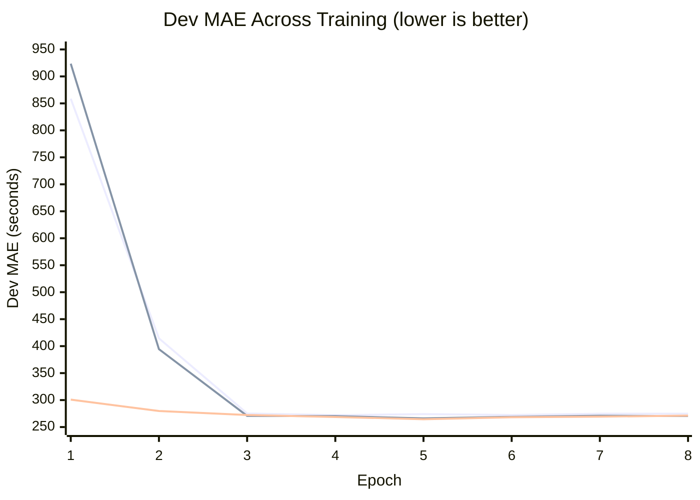
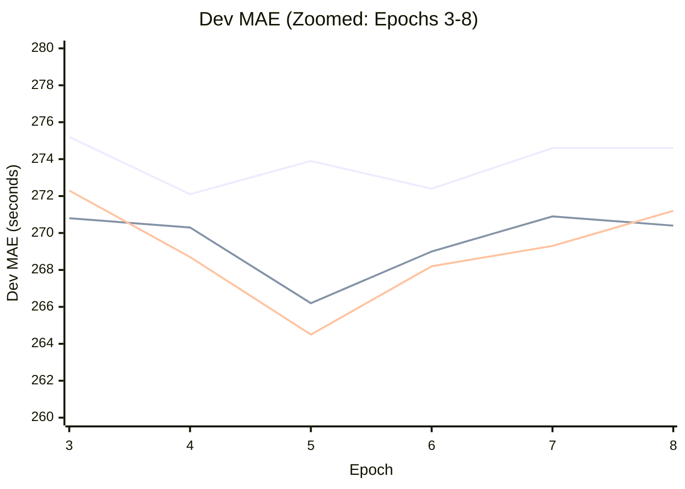

# NYC ETA Engine

[](https://www.shawonline.co.za/redirl)

Predicting NYC taxi trip duration from pickup/dropoff zones, request
timestamp, and passenger count. Built for the Gobblecube ETA Challenge.

See [CHALLENGE.md](CHALLENGE.md) for the original problem statement and rules.

---

## Approach

### Problem

Given a ride request (pickup zone, dropoff zone, timestamp, passenger count),
predict trip duration in seconds. Scored on MAE against a held-out 2024
winter-holiday eval set.

### Design Philosophy

The model is **generic** -- it learns all spatial relationships from the trip
data itself via embeddings, not from external geography (no shapefiles, no
hardcoded coordinates). If the zone IDs mapped to a different city, the model
would learn equally well given the same trip patterns.

### Architecture: NN + LightGBM Ensemble

Two models with complementary strengths, blended 50/50 at inference.

**Model 1: Tabular Neural Net (560k params)**

```
Zone Branch:
  pickup_zone  -> Embedding(266, 50)  --\
  dropoff_zone -> Embedding(266, 50)  ---+-- [pu, do, pu*do, pu-do, pair_hash]
  (pu, do)     -> HashEmbed(16384, 16) -/        |
                                           concat(216) -> MLP(128) x2 -> 128-dim

Continuous Branch:
  24 features -> BatchNorm(24) -> MLP(128) x2 -> 128-dim

Combined:
  concat(256) -> ResidualBlock(256)
             -> project(128) -> ResidualBlock(128)
             -> Linear(64) -> SiLU -> Linear(1)
```

Trained on full 37M rows with Huber loss, OneCycleLR, GPU. High precision
but systematic underprediction bias (-106s) on rare/long trips.

**Model 2: LightGBM (81 trees, 2.4 MB)**

Gradient-boosted tree on same 24 features + zone IDs as native categoricals.
Trained on 10M rows with MAE objective. Near-zero bias (-6s) because trees
partition the feature space directly rather than interpolating through
embeddings.

**Ensemble:** `pred = 0.5 * nn_pred + 0.5 * lgbm_pred`

The NN excels at smooth interpolation for common routes; LightGBM excels at
rare/unusual routes where zone-pair statistics are sparse. Blending averages
out the NN's bias while keeping both models' precision.

**Feature groups (26 total):**

1. **Zone-pair statistics (14 features)** -- precomputed mean, median, std,
   p25, p75, IQR, trip count per (pickup, dropoff) pair with Bayesian
   shrinkage for sparse pairs. Time-bucketed mean/median (6 time-of-day
   buckets). Pair rarity signal (1/(1+log1p(count))) for rare-pair awareness.
   Fallback hierarchy: pair -> pickup-zone -> dropoff-zone -> global.
2. **Temporal features (10 features)** -- cyclical sin/cos encoding for hour,
   day-of-week, month. Binary flags for weekend, rush hour, night. Normalized
   minute-of-day.
3. **Zone embeddings (2 categorical)** -- separate learned embeddings for
   pickup and dropoff zones (dim=50 each), plus element-wise product
   (similarity) and difference (directionality), plus a hash-based zone-pair
   embedding (16k buckets, dim=16).

---

## Results

| Method | Dev MAE | Notes |
|--------|---------|-------|
| Predict global mean | ~580 s | -- |
| XGBoost baseline (6 features) | 351.0 s | Challenge baseline |
| Zone-pair smoothed mean | 302.7 s | Statistics only |
| Zone-pair median | 296.7 s | Statistics only |
| Zone-pair time-bucketed mean | 277.9 s | Statistics only |
| Neural net v1 (L1, 19 features) | 272.1 s | 372k params |
| Neural net v2 (Huber, 24 features) | 266.2 s | +temporal zone-pair stats |
| Neural net v3 (residual, Huber) | 264.5 s | +embedding interactions |
| Neural net v4b | 264.3 s | Lower dropout, pair_rarity |
| LightGBM (81 trees, MAE) | 263.1 s | 10M rows, 2.4 MB |
| **NN + LightGBM ensemble** | **254.0 s** | **alpha=0.50, -28% vs XGBoost** |

---

## Experiments

### v1: Baseline Neural Net

**What:** Tabular neural net with separate zone embedding and continuous
feature branches, combined MLP, L1 loss. 19 continuous features (8 zone-pair
stats + 11 temporal). 372k parameters.

**Why:** Zone-pair median alone (296.7s) beats XGBoost (351s), so the dominant
signal is the pickup-dropoff pair. A neural net can learn nonlinear
interactions between zone embeddings and temporal features that simple
statistics miss.

| Epoch | Train Loss | Dev MAE |
|-------|-----------|---------|
| 1 | 968.5 | 858.7 s |
| 2 | 669.0 | 414.5 s |
| 3 | 281.8 | 275.2 s |
| 4 | 245.3 | **272.1 s** |
| 5 | 241.9 | 273.9 s |
| 6 | 239.9 | 272.4 s |
| 7 | 238.9 | 274.6 s |

**Result:** 272.1s (epoch 4, early stopped at 7). Train-dev gap of ~33s
indicates moderate overfitting.

**Takeaway:** Most learning happens in epochs 2-3 as embeddings lock onto
zone-pair patterns. After that, diminishing returns. Error analysis revealed
systematic underprediction on long trips (-970s bias for 2400s+ trips).

---

### v2: Temporal Features + Huber Loss

**What changed:**
- 5 new features (19 -> 24): time-bucketed zone-pair mean/median (6 time-of-day
  buckets with Bayesian shrinkage), pair IQR, log trip count, same-zone flag
- Huber loss (delta=300) instead of L1: L2 penalty for errors < 300s, L1 for
  larger errors

**Why:** Error analysis of v1 showed the same zone pair varies 2.2x by time of
day (e.g., zone 237->236: 251s at 5AM vs 552s at 2PM). Temporal zone-pair
stats capture this. Huber loss addresses the long-trip underprediction bias by
penalizing large errors less aggressively than L2 but more than L1.

| Epoch | Train Loss | Dev MAE |
|-------|-----------|---------|
| 1 | 246048.6 | 923.5 s |
| 2 | 156510.2 | 394.5 s |
| 3 | 50746.7 | 270.8 s |
| 4 | 41775.0 | 270.3 s |
| 5 | 40995.2 | **266.2 s** |
| 6 | 40563.6 | 269.0 s |
| 7 | 40314.5 | 270.9 s |
| 8 | 40164.9 | 270.4 s |

**Result:** 266.2s (epoch 5, early stopped at 8). 6s improvement over v1.

**Takeaway:** Temporal features helped but less than expected -- the model may
already learn temporal-zone interactions via embeddings. The plateau at ~266s
suggested architecture was the bottleneck, not features.

---

### v3: Residual Architecture + Embedding Interactions

**What changed:**
- Element-wise product (`pu * do`) captures zone similarity (zones that
  co-occur in similar trip patterns get similar embeddings, so their product
  is large)
- Element-wise difference (`pu - do`) captures directionality (A->B vs B->A
  have opposite signs)
- Deeper zone interaction MLP (2 layers instead of 1)
- Wider continuous branch (128-dim instead of 64-dim)
- Residual blocks in combined MLP for better gradient flow
- Higher dropout (0.3) and embed dropout (0.15)
- Parameters: 372k -> 560k

**Why:** v2 plateaued at 266s despite strong features, suggesting the
architecture couldn't fully exploit the inputs. Residual connections help
deeper networks train stably. Embedding interactions provide explicit
similarity/direction signals without the model needing to learn them from
scratch.

| Epoch | Train Loss | Dev MAE |
|-------|-----------|---------|
| 1 | 94684.9 | 300.8 s |
| 2 | 41304.7 | 279.7 s |
| 3 | 39168.2 | 272.3 s |
| 4 | 38266.6 | 268.7 s |
| 5 | 37758.8 | **264.5 s** |
| 6 | 37414.8 | 268.2 s |
| 7 | 37193.0 | 269.3 s |
| 8 | 37054.8 | 271.2 s |

**Result:** 264.5s (epoch 5, early stopped at 8). 1.7s improvement over v2.

**Takeaway:** Architecture changes gave modest gains. The residual blocks
helped stabilize deeper training, but the model still plateaus after epoch 5.
Train loss continues dropping while dev MAE rises -- classic overfitting
signal. Next steps: L1 vs Huber A/B test, reduced hash buckets.

---

### Learning Curves





**Key observations from the curves:**
- All versions converge rapidly (epochs 1-3), then plateau
- v3 starts lower (300.8 vs 858/923) due to better architecture initialization
- The convergence gap narrows with each version: diminishing returns on architecture alone
- All versions show dev MAE rising after epoch 5 -- overfitting window is consistent

---

## Project Structure

```
.
├── CHALLENGE.md              # Original challenge README (reference)
├── SUBMISSION_TEMPLATE.md    # Writeup template for final submission
├── baseline.py               # Original XGBoost baseline (reference)
├── predict.py                # Submission interface (grader imports this)
├── grade.py                  # Local scoring harness
├── train.py                  # Training script (GPU, MLflow tracked)
├── Dockerfile                # Submission packaging
├── requirements.txt          # Python dependencies
├── features/                 # Feature engineering modules
│   ├── zone_pair_stats.py    # Zone-pair statistical features
│   ├── temporal.py           # Temporal feature extraction
│   └── pipeline.py           # Unified feature pipeline
├── model/                    # Neural network
│   ├── architecture.py       # ETAModel definition
│   └── dataset.py            # PyTorch Dataset/DataLoader
├── scripts/
│   └── upload_data_hf.py     # Push data to HF Hub
├── notebooks/
│   └── train_gpu.ipynb       # Colab/Kaggle training notebook
├── data/
│   ├── download_data.py      # Fetches NYC TLC data
│   ├── schema.md             # Data schema documentation
│   └── zone_pair_stats/      # Generated artifacts (gitignored)
└── tests/
    └── test_submission.py    # Smoke tests for submission contract
```

---

## Setup

```bash
python -m venv .venv && source .venv/bin/activate
pip install -r requirements.txt

# Compute zone-pair stats
python -m features.zone_pair_stats

# Train (GPU recommended, or use notebooks/train_gpu.ipynb on Colab/Kaggle)
python train.py --epochs 10 --batch-size 8192 --lr 5e-4 --loss huber --run-name v3

# Score on dev set
python grade.py
```

---

## What Worked

- **NN + LightGBM ensemble (biggest win: -7.2s):** The two models make
  complementary errors. NN underpredicts rare/long trips (bias -106s); LGBM
  has near-zero bias (-6s). Blending gives best of both worlds.
- **Zone-pair statistics as features:** Zone-pair median alone (296.7s) beats
  XGBoost (351s) with zero ML. Bayesian shrinkage handles sparse pairs.
- **LightGBM with native categoricals:** Trees handle zone IDs directly via
  splits. No embedding needed. Better for rare pairs by design.
- **Learned zone embeddings:** The neural net learns spatial relationships
  purely from trip patterns. No external geography needed.
- **Element-wise embedding interactions:** Product captures zone similarity,
  difference captures trip directionality (A->B vs B->A).
- **Deep diagnostics before tuning:** Parameter health, rare-pair analysis,
  and regularization checks revealed the true bottleneck (rare-pair bias) and
  prevented wasted experiments on architecture changes.
- **OneCycleLR with warmup:** Stable training from step 1. Avoids NaN
  gradients on randomly initialized embeddings.
- **Chunked data processing:** 37M rows in 2M chunks keeps memory under 6GB,
  enabling training on free-tier Kaggle (13GB RAM).

## What Didn't Work

- **Reducing hash buckets (16k -> 8k):** 13s regression. Hash embeddings at
  47% of params are critical -- too many collisions destroys pair-level signal.
- **Removing month features:** 13s regression. Even though constant in dev/eval,
  month_sin/cos help the model distinguish seasonal patterns during training.
- **Log-target + Huber loss:** Huber(delta=300) in log-space is pure MSE since
  log-space errors never exceed 6. Loss/metric mismatch.
- **Training on small samples (500k rows):** Converged to ~945s MAE.
  Embeddings need the full 37M rows to learn meaningful zone relationships.
- **Architecture tuning past v3:** Dropout reduction, pair_rarity feature, and
  various configs all landed at 264s. The NN ceiling is structural.

## Next Steps

- Post-hoc bias correction / prediction rescaling (2-5s potential)
- FT-Transformer exploration (tabular transformer)
- Larger LGBM (full 37M rows, more trees)
- Final submission packaging (Dockerfile, README writeup)

---

## Constraints

- Inference: <= 200 ms per request on CPU (actual: <1 ms)
- Docker image: <= 2.5 GB (estimated: ~500 MB)
- No external API calls at inference time
- No 2024 data in training
